# 🏛️ First Golden Horizon Bank — Institutional Wealth & Private Banking Platform

[](https://reactjs.org/)
[](https://vitejs.dev/)
[](https://developer.mozilla.org/en-US/docs/Web/JavaScript)
[](https://www.w3.org/Style/CSS/)
[]()

---

## 📖 Table of Contents

- [Overview](#-overview)
- [Key Features](#-key-features)
- [System Architecture & Tech Stack](#-system-architecture--tech-stack)
- [Project Directory Structure](#-project-directory-structure)
- [Getting Started](#-getting-started)
  - [Prerequisites](#prerequisites)
  - [Installation & Setup](#installation--setup)
  - [Development Server](#development-server)
  - [Production Build](#production-build)
- [Admin Command Center & CRM](#-admin-command-center--crm)
  - [Access Methods](#access-methods)
  - [Default Administrator Credentials](#default-administrator-credentials)
  - [Administrative Modules](#administrative-modules)
- [Institutional Onboarding Flow (KYC / AML)](#-institutional-onboarding-flow-kyc--aml)
- [Design System & Theme Engine](#-design-system--theme-engine)
- [Data Persistence & Backup](#-data-persistence--backup)
- [Contributing & Maintenance](#-contributing--maintenance)

---

## 🌟 Overview

**First Golden Horizon Bank** (Apex Wealth Platform) is a premier institutional wealth management and private banking web application. Engineered with an ultra-luxurious visual design, responsive glassmorphic interfaces, and comprehensive full-stack simulation capabilities, the platform provides high-net-worth individuals and corporate entities with a private banking experience.

The platform includes:
- An **Institutional Landing & Discovery Experience** highlighting wealth strategies, asset custody, and zero-knowledge security.
- An **8-Step KYC / AML Account Opening Onboarding Flow** with biometric selfie capture, multi-jurisdiction ID verification, and payment verification.
- **Hosted Simulation Sandboxes** for **Stripe Identity Verification** and **Plaid Open Banking Link**.
- An **Interactive Client Dashboard Preview** featuring portfolio performance telemetry, asset allocation analytics, live holdings, and an encrypted document vault.
- An **Enterprise Admin Command Center & CRM** with live application reviews, dossier inspections, CMS editors, audit logging, and JSON database backup/restore.

---

## ✨ Key Features

### 1. 🌐 Institutional Showcase & Landing Experience
- **Hero & Global Metrics**: Real-time asset custody figures, capital reserves, global liquidity metrics, and regulatory indicators.
- **Wealth Solutions CMS**: Structured service offerings across Discretionary Asset Management, Family Office Advisory, Private Debt, and Cross-Border Custody.
- **Zero-Knowledge Security Hub**: Interactive presentation of 256-bit AES encryption, multi-party computation (MPC), hardware security modules (HSM), and biometric authentication.
- **Interactive FAQ Section**: Categorized accordion answering institutional onboarding, custody limits, tax residency, and compliance questions.

### 2. 🔐 8-Stage Institutional KYC/AML Onboarding
A multi-step onboarding system capturing complete compliance profiles:
1. **Personal Demographics**: Full name, preferred salutation, email, verified phone, DOB, and marital status.
2. **Residential & Jurisdiction**: Street address, unit/penthouse, city, state/canton, postal code, and sovereign country.
3. **Professional & Wealth Profile**: Employment status, occupation, source of wealth, annual income tier, and primary banking counterpart.
4. **Government ID & Biometrics**: ID type selection (Passport, Driver's License, National ID), document front/back photo capture, biometric live selfie verification, and SSN/Tax ID.
5. **Funding & Card Verification**: Cardholder details, issuing bank, masked card digits, expiry, and visual card confirmation.
6. **Investment Mandate & Horizon**: Account classification (Individual Wealth, Family Office, Corporate Treasury), risk profile, base currency, and time horizon.
7. **Verification Sandboxes**:
   - 💳 **Stripe Identity Verification Sandbox**: Document OCR scan, liveness check, and biometric match simulation.
   - 🏦 **Plaid Open Banking Sandbox**: Institution lookup, automated credential authentication, and instant balance verification.
8. **Review, Consent & Digital Signature**: Complete application dossier review with audit timestamps and cryptographic reference generation (e.g. `FHB-8492-7104`).

### 3. 📊 Client Portal & Telemetry Demonstration
- **Portfolio Valuation & Real-Time Performance Charts**: Toggle between 1M, 6M, 1Y, and All-Time return trajectories.
- **Asset Allocation Visualizer**: Dynamic asset allocation breakdown (Global Equities, Sovereign Fixed Income, Private Equity, Liquid Cash & Gold).
- **Holdings Management Table**: Live tracking of ISIN/CUSIP assets, allocations, purchase cost, market valuations, and daily change metrics.
- **Encrypted Document Vault**: Instant access to monthly custodial statements, tax documentation, and regulatory disclosures.

### 4. 🛡️ Admin Command Center & Governance CRM
- **Access Controls**: Multi-tier administrative authentication with configurable master credentials.
- **CRM Application Pipeline**: Filter, search, inspect, approve, reject, or flag client onboarding applications.
- **Application Dossier Inspection Modal**: View client documents, uploaded ID cards, selfies, financial profile, and compliance notes.
- **Platform Content Management (CMS)**: Add, modify, or delete solutions, FAQs, and homepage headline statistics.
- **Holdings & Metrics Editor**: Adjust client portal figures, update benchmark allocations, and add new assets.
- **Immutable Audit Trail**: Chronological event logging tracking administrative logins, status transitions, and data alterations.
- **Database Backup & Migration**: One-click JSON database export and import for seamless state synchronization.

---

## 🛠️ System Architecture & Tech Stack

```
First Golden Horizon Bank
 ├── Frontend Layer: React 18.2 (Hooks, Context API, Modular Components)
 ├── Bundler & Dev Tooling: Vite 5.0 (Hot Module Replacement, Fast ESM Builds)
 ├── Styling & Design System: Vanilla CSS3 (Custom Properties, Glassmorphism, Responsive Grid)
 ├── Typography: Google Fonts (Outfit & Plus Jakarta Sans)
 └── Data Layer: React Context API (DataContext) backed by LocalStorage Persistence
```

### Technology Highlights

| Technology | Purpose |
| :--- | :--- |
| **React 18** | High-performance component-driven interface with state management |
| **Vite 5** | Lightning-fast development server and optimized production bundler |
| **Vanilla CSS3** | Custom tokens, dark/light theme variables, micro-animations, and responsive layout |
| **React Context API** | Global state distribution across applications, CMS data, portal metrics, and admin credentials |
| **Web Storage API** | Real-time persistence across browser reloads without external database dependencies |

---

## 📁 Project Directory Structure

```plaintext
first-golden-horizon-bank/
├── project/
│   ├── index.html                     # Main HTML5 entrypoint with SEO metadata & fonts
│   ├── package.json                   # Dependencies, scripts, and project metadata
│   ├── vite.config.js                 # Vite bundler configuration with React plugin
│   ├── dist/                          # Production build output
│   └── src/
│       ├── main.jsx                   # React root mount point
│       ├── App.jsx                    # Core Application layout & modal orchestrator
│       ├── index.css                  # Comprehensive design system & styles
│       ├── context/
│       │   └── DataContext.jsx        # Global data provider, state reducers & persistence
│       ├── data/
│       │   └── initialData.js         # Initial mock database (applications, stats, FAQs)
│       └── components/
│           ├── Navbar.jsx             # Top navigation with theme toggle & shortcuts
│           ├── Hero.jsx               # Headline section with dynamic metric counters
│           ├── Features.jsx           # Wealth management solutions showcase
│           ├── SecurityArchitecture.jsx# Zero-knowledge security engine breakdown
│           ├── DashboardPreview.jsx   # Interactive client portal demo & holdings
│           ├── FaqSection.jsx         # Accordion FAQ component
│           ├── Footer.jsx             # Comprehensive footer with legal & admin gateway
│           ├── admin/
│           │   ├── AdminLogin.jsx     # Administrator passcode authentication gateway
│           │   ├── AdminModal.jsx     # Full-featured Admin Command Center & CRM
│           │   ├── ApplicationDetailModal.jsx # Client dossier & document viewer
│           │   └── EditEntityModal.jsx # Modal for editing solutions, FAQs, and metrics
│           ├── modals/
│           │   ├── PlaidModal.jsx     # Plaid open-banking link sandbox modal
│           │   └── StripeIdentityModal.jsx # Stripe Identity verification sandbox modal
│           └── onboarding/
│               ├── OpenAccountModal.jsx # Multi-step account opening container
│               └── OnboardingFlow.jsx # Step-by-step KYC/AML form workflow
└── README.md                          # Project documentation
```

---

## 🚀 Getting Started

### Prerequisites

Ensure you have the following installed on your workstation:
- **Node.js**: Version `18.0.0` or higher
- **npm**: Version `9.0.0` or higher (bundled with Node.js)

### Installation & Setup

1. **Clone or navigate into the repository**:
   ```bash
   cd project
   ```

2. **Install project dependencies**:
   ```bash
   npm install
   ```

### Development Server

Start the local development server with Hot Module Replacement (HMR):

```bash
npm run dev
```

The application will launch at:
```
http://localhost:5173
```

### Production Build

To compile and bundle the application for production deployment:

```bash
npm run build
```

The optimized static assets will be output to the `project/dist/` directory.

To preview the production build locally:
```bash
npm run preview
```

---

## 🔐 Admin Command Center & CRM

The platform includes an **Admin Command Center** for bank governance officers and compliance managers.

### Access Methods

You can trigger the Administrator Gateway using any of the following methods:

1. **Keyboard Shortcut**: Press `Ctrl + Shift + A` (or `Cmd + Shift + A` on macOS).
2. **URL Hash**: Navigate to `http://localhost:5173/#admin`.
3. **Navbar**: Click the **Admin Access** button in the top navigation bar.
4. **Footer**: Click the **Administrator Portal** link in the footer.

---

### Default Administrator Credentials

> [!IMPORTANT]
> The initial administrative credentials configured in `DataContext.jsx`:

- **Email**: `marinepatrolll@gmail.com`
- **Master Passcode**: `Emma1234?`
- **Role**: *Principal Governance Officer*

*Credentials can be customized or reset inside the Admin Command Center under the **Security** tab.*

---

### Administrative Modules

```
┌─────────────────────────────────────────────────────────────┐
│                 ADMIN COMMAND CENTER                        │
├───────────────┬─────────────────────────────────────────────┤
│ Applications  │ Review, approve, reject & inspect dossiers  │
│ Security      │ Manage admin email, password & credentials  │
│ Overview      │ Platform KPIs, total volume, active clients │
│ Solutions     │ Create, edit, and reorganize wealth plans   │
│ FAQs          │ Manage categorized customer support queries │
│ Client Portal │ Adjust portfolio figures & holdings data    │
│ Hero Stats    │ Update headline platform metrics & badges   │
│ Audit Trail   │ Review immutable system event logs          │
│ Backup / JSON │ Full export and import of database snapshot │
└───────────────┴─────────────────────────────────────────────┘
```

---

## 📋 Institutional Onboarding Flow (KYC / AML)

```mermaid
flowchart LR
    A[Start Application] --> B[1. Demographics]
    B --> C[2. Residential Info]
    C --> D[3. Financial Profile]
    D --> E[4. ID & Biometric Capture]
    E --> F[5. Card Verification]
    F --> G[6. Investment Mandate]
    G --> H[7. Stripe / Plaid Sandboxes]
    H --> I[8. Digital Signature & Submit]
    I --> J[Stored in CRM with Reference ID]
```



Every submission generates an application record with a unique identifier (e.g., `FHB-XXXX-XXXX`), which is instantly routed to the Admin Command Center for compliance review.

---

## 🎨 Design System & Theme Engine

The application features a modern, ultra-responsive design system built on Vanilla CSS variables:

- **Typography**: 
  - Headings: `Outfit` (800, 700, 600, 500)
  - Body & UI: `Plus Jakarta Sans` (700, 600, 500, 400)
- **Color Palette**:
  - **Gold & Bronze Accents**: `#D4AF37`, `#F5D77F`, `#996515`
  - **Dark Mode Backgrounds**: Deep navy and obsidian glass surfaces (`#070B14`, `#0D1527`, `#111C38`)
  - **Light Mode Backgrounds**: Crisp platinum and ivory slate (`#F8FAFC`, `#FFFFFF`, `#E2E8F0`)
- **Visual Effects**:
  - CSS Glassmorphism with `backdrop-filter: blur(16px)`
  - Ambient radiant glow orbs
  - Interactive 3D micro-transforms and hover states
  - Seamless Dark/Light theme switching persisted in `localStorage`

---

## 💾 Data Persistence & Backup

All modifications made via the client application or Admin Command Center are synced to the browser's `localStorage` engine across specific storage keys:

- `apex_data_applications_v2` — Submitted client KYC/AML applications
- `apex_data_solutions_v2` — Wealth management solutions catalog
- `apex_data_faqs_v2` — FAQ directory
- `apex_data_herostats_v2` — Headline platform statistics
- `apex_data_portal_v2` — Simulated client portfolio & asset allocations
- `apex_data_auditlogs_v2` — System audit logs
- `fgh_admin_credentials_v1` — Configured administrator credentials

### Exporting & Restoring Database

1. Open the Admin Command Center (`Ctrl + Shift + A`).
2. Click **Export Data (JSON)** in the header to download a complete backup.
3. Use **Import Data (JSON)** to restore data or migrate state to another machine.
4. Click **Reset Defaults** at any time to restore the initial seed database.

---

## 📄 License & Terms

Copyright © 2026 First Golden Horizon Bank. All rights reserved.  
Institutional Wealth & Private Banking Platform.
